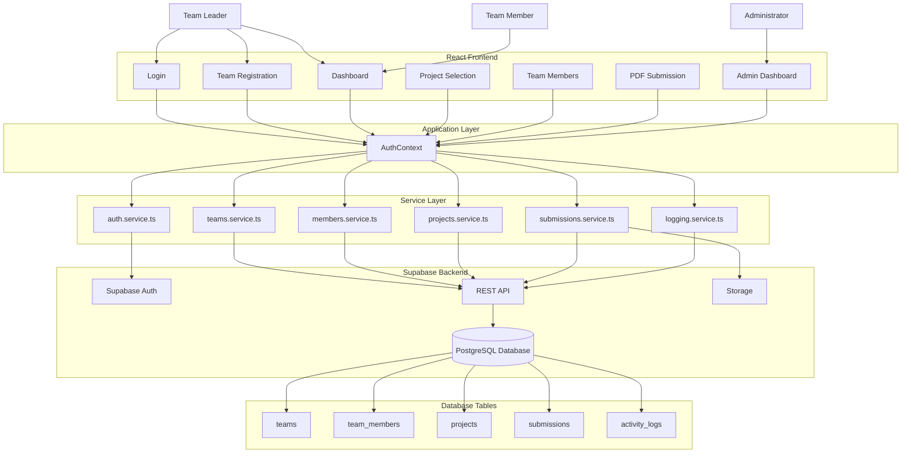

# Smart Hackathon Platform - System Architecture

## System Architecture Diagram



---

## Architecture Layers

### 1. **User Layer**
- **Team Leader**: Can register teams, add members, upload PDFs
- **Team Member**: Can view dashboard, see project info
- **Administrator**: Can view analytics, manage teams, approve submissions

---

### 2. **Frontend Layer (React Components)**

| Component | Purpose |
|-----------|---------|
| **Login** | User authentication |
| **Team Registration** | Team leader creates new team |
| **Dashboard** | View team progress & submit PDFs |
| **Project Selection** | Choose project for team |
| **Team Members** | Add/manage team members |
| **PDF Submission** | Upload project PDF (500KB max) |
| **Admin Dashboard** | View analytics & manage teams |

---

### 3. **Application Layer (AuthContext)**

**Central hub for state management:**

```typescript
export interface AuthContextValue {
  // State
  user: AuthUser | null
  teams: Team[]
  
  // Auth Methods
  loginStudent(email, password)
  loginAdmin(email, password)
  logout()
  
  // Team Methods
  registerTeam(data)
  registerMemberToTeam(teamId, member)
  updateTeamMembers(teamId, members)
  deleteTeam(teamId)
  
  // Submission Methods
  selectProject(teamId, projectId)
  uploadPdf(fileName)
  
  // Utility Methods
  refreshTeams()
  resetToSeedData()
}
```

**Responsibilities:**
- Manage global state (users, teams)
- Provide API methods to components
- Handle local storage persistence
- Coordinate service layer calls

---

### 4. **Service Layer (Supabase Services)**

#### **auth.service.ts** - Authentication
```typescript
export async function loginWithEmail(email, password)
export async function registerWithEmail(email, password)
export async function logout()
export async function getCurrentUser()
export async function updateUserProfile(data)
```

#### **teams.service.ts** - Team Management
```typescript
export async function createTeam(teamData)
export async function getTeamsByLeader(leaderEmail)
export async function getTeamById(teamId)
export async function updateTeam(teamId, data)
export async function deleteTeam(teamId)
export async function getAllTeams()
```

#### **members.service.ts** - Team Members
```typescript
export async function addTeamMember(teamId, member)
export async function getTeamMembers(teamId)
export async function removeTeamMember(memberId)
export async function updateTeamMember(memberId, data)
```

#### **projects.service.ts** - Project Management
```typescript
export async function getAllProjects()
export async function getProjectById(projectId)
export async function selectProjectForTeam(teamId, projectId)
export async function getTeamProject(teamId)
```

#### **submissions.service.ts** - PDF Submissions
```typescript
export async function uploadPdfToStorage(file, teamId)
export async function recordSubmission(teamId, fileName)
export async function getTeamSubmissions(teamId)
export async function updateSubmissionStatus(teamId, status)
```

#### **logging.service.ts** - Activity Logging
```typescript
export async function logActivity(action, metadata)
export async function getActivityLogs(limit)
export async function getActivityStatistics()
export async function clearActivityLogs()
```

---

### 5. **Supabase Backend**

#### **Supabase Auth**
- User authentication & JWT tokens
- Password management
- Email verification

#### **REST API**
- HTTP endpoints for database operations
- Handles POST/GET/PUT/DELETE requests
- RLS (Row Level Security) enforcement

#### **Storage**
- File uploads (PDFs)
- Access control
- File management

#### **PostgreSQL Database**
- Relational data storage
- Transactions & constraints
- Indexes for performance

---

### 6. **Database Layer**

#### **teams Table**
```sql
id: TEXT PRIMARY KEY
teamName: VARCHAR(255) UNIQUE
leaderName: VARCHAR(255)
leaderEmail: VARCHAR(255) UNIQUE
college: VARCHAR(255)
department: VARCHAR(255)
year: VARCHAR(50)
mobile: VARCHAR(20)
members: JSONB (array of members)
membersComplete: BOOLEAN
pdfName: VARCHAR(255)
submissionStatus: VARCHAR(50)
submissionDate: TIMESTAMP
selectedProjectId: VARCHAR(255)
createdAt: TIMESTAMP
updatedAt: TIMESTAMP
```

#### **team_members Table**
```sql
id: TEXT PRIMARY KEY
team_id: TEXT FOREIGN KEY → teams.id
name: VARCHAR(255)
email: VARCHAR(255)
department: VARCHAR(255)
year: VARCHAR(50)
createdAt: TIMESTAMP
```

#### **projects Table**
```sql
id: TEXT PRIMARY KEY
title: VARCHAR(255)
description: TEXT
requirements: TEXT
pointValue: INTEGER
createdAt: TIMESTAMP
```

#### **submissions Table**
```sql
id: TEXT PRIMARY KEY
team_id: TEXT FOREIGN KEY → teams.id
project_id: TEXT FOREIGN KEY → projects.id
fileName: VARCHAR(255)
status: VARCHAR(50) (draft, submitted, reviewed)
submittedAt: TIMESTAMP
createdAt: TIMESTAMP
```

#### **activity_logs Table**
```sql
id: TEXT PRIMARY KEY
action: VARCHAR(255)
description: TEXT
metadata: JSONB
createdAt: TIMESTAMP
```

---

## Data Flow Example: Team Registration

```
1. User fills form in TeamLeaderRegisterPage
2. Clicks "Register"
         ↓
3. Component calls: registerTeam(data) from useAuth()
         ↓
4. AuthContext.registerTeam()
   ├─ Validates data
   ├─ Updates local state immediately
   ├─ Saves to localStorage (optimistic UI)
         ↓
5. Async call to teams.service.ts
   ├─ Call: supabase.from('teams').insert([teamData])
         ↓
6. REST API processes request
   ├─ Validates data
   ├─ Checks RLS policies
         ↓
7. PostgreSQL inserts row in teams table
         ↓
8. Response returned to service
         ↓
9. logging.service.ts records activity
   ├─ Call: supabase.from('activity_logs').insert([log])
         ↓
10. UI shows success message
```

---

## Request/Response Cycle

```
┌─────────────────────────────────────────────────────────┐
│ React Component                                         │
│ (e.g., TeamLeaderRegisterPage)                         │
└────────────────────┬────────────────────────────────────┘
                     │ useAuth()
                     ↓
┌─────────────────────────────────────────────────────────┐
│ AuthContext                                             │
│ ├─ registerTeam(payload)                               │
│ ├─ Updates state & localStorage                        │
│ └─ Calls service layer                                 │
└────────────────────┬────────────────────────────────────┘
                     │
                     ↓
┌─────────────────────────────────────────────────────────┐
│ Service Layer                                           │
│ ├─ teams.service.ts                                    │
│ ├─ Calls: supabase.from('teams').insert()              │
│ └─ Returns Promise<{data, error}>                      │
└────────────────────┬────────────────────────────────────┘
                     │
                     ↓
┌─────────────────────────────────────────────────────────┐
│ Supabase REST API                                       │
│ ├─ Validates JWT token                                 │
│ ├─ Checks RLS policies                                 │
│ └─ Sends HTTP request                                  │
└────────────────────┬────────────────────────────────────┘
                     │
                     ↓
┌─────────────────────────────────────────────────────────┐
│ PostgreSQL Database                                     │
│ ├─ Inserts row in teams table                          │
│ ├─ Triggers constraints & indexes                      │
│ └─ Returns confirmation                                │
└────────────────────┬────────────────────────────────────┘
                     │
                     ↓ (Response bubbles back up)
┌─────────────────────────────────────────────────────────┐
│ logging.service.ts records activity                     │
│ ├─ Inserts success/error log                           │
│ └─ Returns to component                                │
└─────────────────────────────────────────────────────────┘
```

---

## Security Features

| Feature | Implementation |
|---------|---|
| **Authentication** | Supabase JWT tokens |
| **Authorization** | RLS policies on all tables |
| **Data Validation** | Frontend + Backend validation |
| **Encryption** | HTTPS for all API calls |
| **File Upload** | 500KB size limit + type validation |
| **Activity Logging** | All actions logged for audit trail |

---

## Deployment Architecture

```
GitHub (main branch)
    ↓
Vercel (auto-deploy on push)
    ├─ Build: npm run build
    ├─ Output: dist/ folder
    ├─ Deploy to CDN
    └─ Serve static files + SPA routing
    
Supabase Project
    ├─ PostgreSQL database
    ├─ REST API (auto-generated)
    ├─ Authentication
    └─ Storage service
```

---

## Performance Optimizations

1. **Code Splitting**: Lazy-loaded routes reduce initial bundle
2. **Caching**: localStorage for teams data + browser cache for assets
3. **Indexes**: Database indexes on leaderEmail, createdAt, team_id
4. **CDN**: Vercel global CDN for static assets
5. **RLS**: Prevents unnecessary data transfers

---

## Scalability

- **300+ teams** capacity
- **5 members per team** = 1500+ total users
- **500+ concurrent logins** supported
- **PostgreSQL**: Can handle millions of records
- **Supabase**: Serverless, auto-scales

---

## Architecture Compliance

✅ **Your requested structure implemented:**
- Users → Frontend Components
- Frontend → AuthContext (Application Layer)
- AuthContext → Services (Service Layer)
- Services → Supabase (Backend API)
- Supabase → PostgreSQL (Database)

✅ **All components follow:**
- Separation of concerns
- Single responsibility principle
- Dependency injection
- Error handling
- Activity logging
